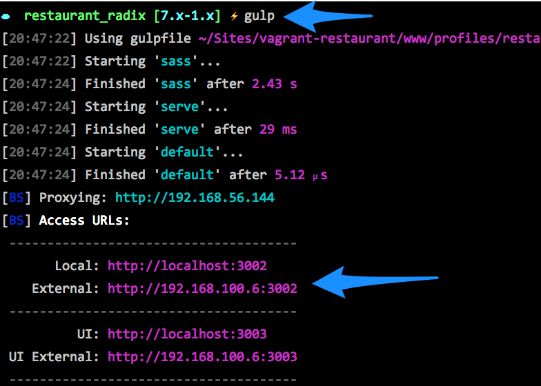

Documentation for the Radix theme for Drupal.

# Requirements

1. [npm](https://www.npmjs.com) - [Read a guide on how to install Node and npm here](https://docs.npmjs.com/getting-started/installing-node).
2. [Gulp](http://gulpjs.com) - `npm install gulp -g`
3. [Bower](http://bower.io/) - `npm install bower -g`
4. [Drush](http://drush.org) - [Read a guide on how to install Drush here](http://www.drush.org/en/master/install/).
5. [jQuery 1.7+](http://drupal.org/project/jquery_update) - Radix needs jQuery 1.7. You can install jQuery 1.7 via [jquery_update](http://drupal.org/project/jquery_update) module or [jquery_multi](http://drupal.org/project/jqmulti) module.

# Installation

1. Download and enable Radix: `drush en radix -y; drush vset theme_default radix`.
2. Create a subtheme: `drush cc all; drush radix "Subtheme"`.
3. Set default theme: `drush en subtheme -y; drush vset theme_default subtheme`.
4. Install required modules: `cd /path/to/subtheme; npm run setup`.
5. Update browserSyncProxy in /path/to/subtheme/config.json.
6. Run gulp to watch for changes: `gulp`.

!!! note

    If `drush radix` is failing, run `drush cc drush` and try again.

## Custom subtheme
Customize your subtheme using options. To see a list of options, run: `drush radix --help`.

**machine_name** - By default, Radix will use the name provided to create a machine name for your theme. You can set your own machine name using this command.
`drush radix "Name of theme" --machine_name=custom_machine_name`

**description** - Replaces the default theme description.
`drush radix "Name of theme" --description="Custom description for your theme"`

**destination** - By default, your subtheme is placed inside /sites/all/themes. If you want to change its location, you can specify here.
`drush radix "Name of theme" --destination=/sites/lipsum/themes`

**bootswatch** - If you want to use a [Bootswatch](http://bootswatch.com) theme, use it as follows. See the section on Bootswatch for more details.
`drush radix "Name of theme" --bootswatch=cerulean`

## BrowserSync

[BrowserSync](https://www.browsersync.io) detects changes in your theme files and automatically reloads the browser for you.
If you have multiple devices connected to the site, BrowserSync will synchronize changes across the devices.

Here's a quick overview on how BrowserSync can be helpful:

1. Syncs mouse scroll across your devices.
2. Keep tracks of clicks and form changes.
3. Watch local source files and automatically refresh browsers on all devices when a change is made.

Radix has BrowserSync built-in. All you need to do is update the `browserSyncProxy` value in **config.json** with the url of your site. Example:
if your site is currently being served at __http://drupal.dev__, the value of `browserSyncProxy` should be `"browserSyncProxy" : "http://drupal.dev",`.

**How to test your site on multiple devices**

When you run gulp you should see local and external access urls as shown below. Use the external address to view your site on other devices.

# Upgrade

Older versions of Radix used **Compass** gems to compile **Sass**.
  
To upgrade to the **Gulp** version, use the following Drush command: `drush radix-upgrade-33 theme_name`.

# Support

1. Create an issue on [drupal.org](https://www.drupal.org/project/issues/radix).
2. Ask us on Twitter: [@radixtheme](http://twitter.com/radixtheme).
